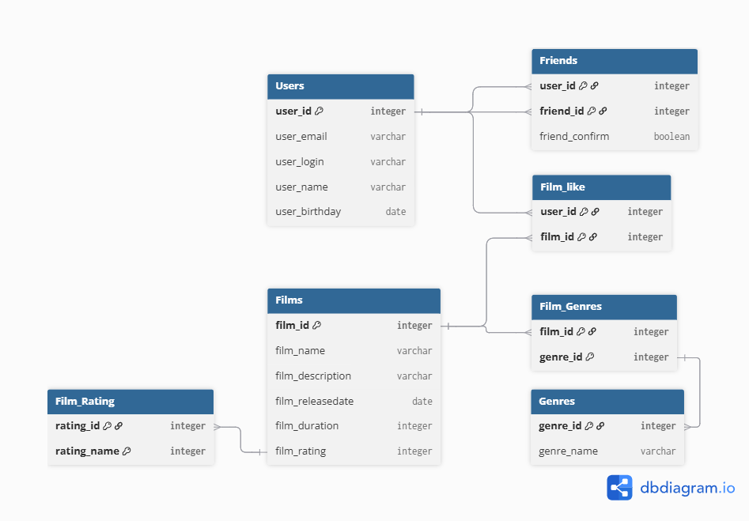

# java-filmorate


## Краткое описание
База данных состоит и 6 SQL таблиц:
1. **Users** - общая таблица с пользователями. 
    - *user_id* - id пользователя
    - *user_email* - адрес почты пользователя
    - *user_login* - логин пользователя
    - *user_name* - имя пользователя
    - *user_birthday* - день рождения пользователя
2. **Friends** - таблица друзей пользователей.
    - *user_id* - id пользователя предложившего дружбу
    - *friend_id* - id пользователя которому предложили дружбу
    - *friend_confirm* - поле показывающее принятие дружбы
3. **Films** - общая таблица с фильмами.
    - *film_id* - id фильма
    - *film_name* - имя фильма
    - *film_description* - описание фильма
    - *film_releasedate* - дата релиза фильма(в формате **YYYY-MM-DD**)
    - *film_duration* - продолжительность фильма в минутах
    - *film_rating* - рейтинг МРА фильма:
        - G — у фильма нет возрастных ограничений
        - PG — детям рекомендуется смотреть фильм с родителями
        - PG-13 — детям до 13 лет просмотр не желателен
        - R — лицам до 17 лет просматривать фильм можно только в присутствии взрослого
        - NC-17 — лицам до 18 лет просмотр запрещён
4. **Film_Genres** - таблица с жанрами фильма
    - *film_id* - id фильма
    - *genre_id* - id жанра
5. **Film_like**
    - *user_id* - id пользователя поставившего "like"
    - *film_id* - id фильма
6. **Genres**
    - *genre_id* - id жанра
    - *genre_name* - имя жанра:

## Описание взаимосвязей таблиц
1. В таблице **Users** первичным ключом является поле *user_id*.
Так-же данное ключ является внешним для таблиц **Friends** и **Film_like**.
Тип связи <ins>one-to-many<ins>.
2. Таблица **Frends** имеет состовной первичный ключ состоящий из 2-ух полей: *user_id* и *freind_id*.
Данные поля так-же являются внешними ключами для таблицы Users. 
3. Для таблицы **Films** первичным ключом является поле *film_id*, являющееся внешним ключом для таблиц **Film_like** и **Film_Genres**.
Тип связи <ins>one-to-many<ins>.
4. Таблица **Film_Genres** имеет первичный ключ *film_id* являющийся внешним для таблицы **Films**.
Так-же поле *genre_id* является внешним ключом для таблици **Genres** с типом связи <ins>one-to-many<ins>.
5. Таблица **Film_like** имеет состовной первичный ключ состоящий из 2-ух полей: *user_id* и *film_id*.
Поле *user_id* является внешним ключом для таблицы **Users**.
Поле *film_id* является внешним ключом для таблицы **Films**.

## Общая структура


## Примеры команд
1. Получение списка всех пользователей

```SQL
SELECT u.user_id,
u.user_login
FROM Users as u;
```

2. Получение списк всех подтверждённых друзей пользователя **X** (где **X** - id пользователя)

```SQL
SELECT f.user_id,
f.friend_id
FROM Friends as f
WHERE f.user_id = X
AND f.friend_confirm = true
ORDER BY f.friend_id;
```

3. Получение списк общих подтверждённых друзей пользователя **X** и **Y** (где **X** и **Y** - id пользователя)

```SQL
SELECT f1.friend_id
FROM Friends f1
INNER JOIN Friends f2 ON f1.friend_id = f2.friend_id
WHERE f1.user_id = X 
  AND f2.user_id = Y 
  AND f1.friend_confirm = true 
  AND f2.friend_confirm = true
ORDER BY f1.friend_id;
```

4. Получение списк всех фильмов

```SQL
SELECT f.film_id,
f.film_name
FROM Films as f;
```

5. Получение списка **N** наиболее популярных фильмов (где **N** - кол-ва фильмов)

```SQL
SELECT f.film_id,
       f.film_name,
       fl.user_like
FROM Films f
INNER JOIN (
    SELECT film_id,
           COUNT(user_id) AS user_like
    FROM Film_like
    GROUP BY film_id
    ORDER BY COUNT(user_id) DESC
    LIMIT N
) AS fl ON f.film_id = fl.film_id
ORDER BY fl.user_like DESC;
```